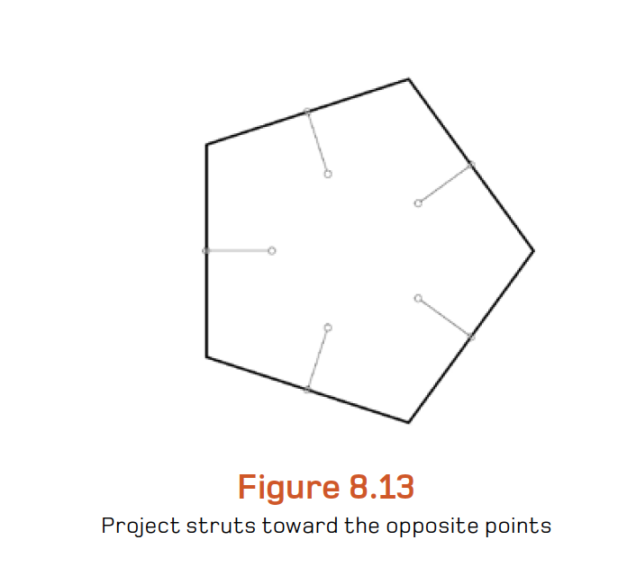
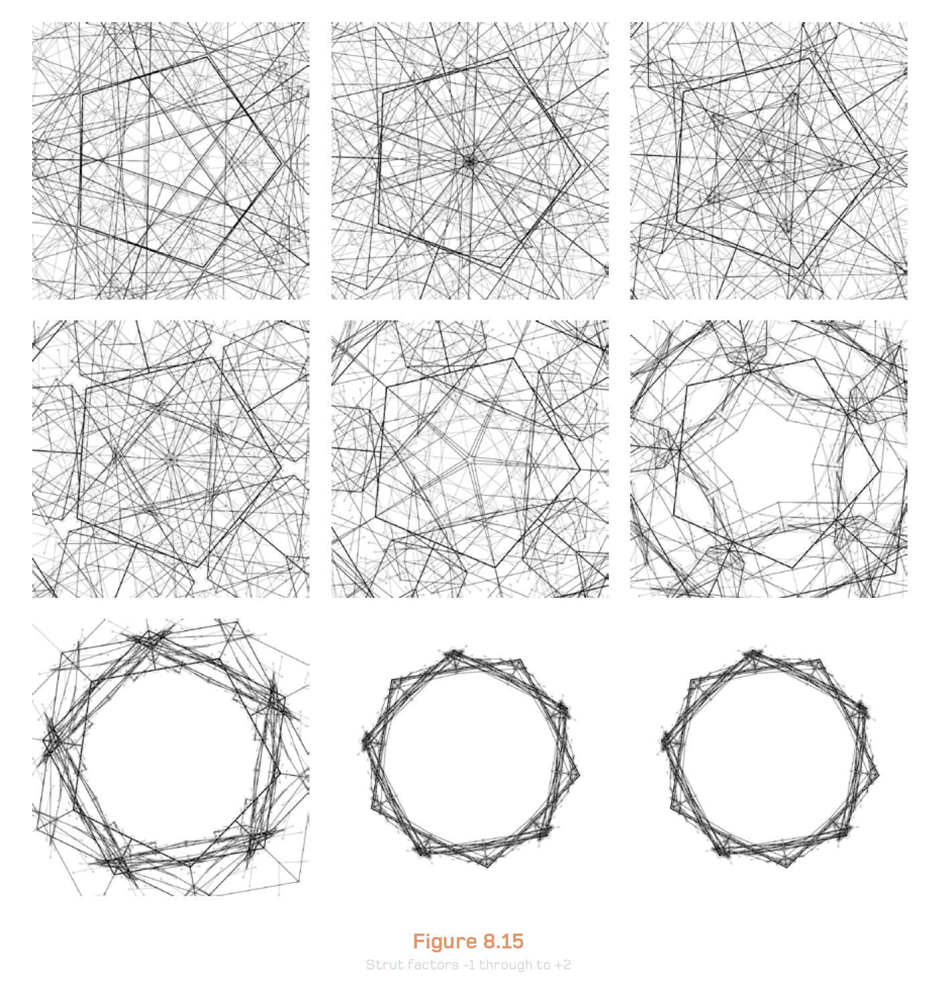

## Generative Art: A Practical Guide using Processing - Matt Pearson

### Generative art
- algorithmically creating an aesthetic
- collaboration between artist and autonomous system

### The 'Processing' programming language
- based on java
- web-rendered
- object-oriented

### The emergence property
- complex outcomes from simple interactions
- `noise functions` used to introduce unpredictability -- or not
- individual interest vs. collective interest

### Object-oriented programming
- object-based rather than instruction-based
- instantiating classes
- e.g. jazz pianist class
  - instances: `KeithJarrett`, `BillEvans`, `ArtTatum`
  - methods (functionality): `recordAlbum()`, `playChord('B-min7')`
- objects are 'active citizens' with traits and individual interests

### Autonomy
- subsystems have freedom of choice
- cellular automata
  - segregation (http://nifty.stanford.edu/2014/mccown-schelling-model-segregation/)
  - game of life (https://playgameoflife.com/)

### Fractals
- shapes or patterns that repeat at many levels with self-similar structures
- occurs in nature
- algorithmically reproduced by loops and recursion
- has emergent structure

